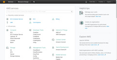
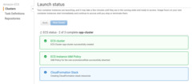
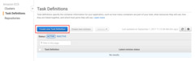
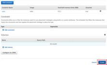
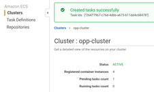
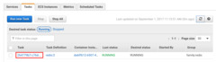
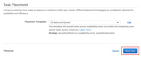
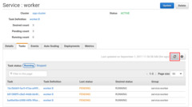

First you need an AWS account, so if you don't already have one, follow the
[sign-up procedure](https://portal.aws.amazon.com/gp/aws/developer/registration/index.html).
You will need to provide some personal information to Amazon, including full
name, address, phone number, and a valid credit card. Then you will need to
verify your identity via a phone call, or similar method.

Don't worry, the computing power we will use is included in the Free Tier
package. If you're eligible for that, and won't leave virtual machines running
and forget about them for days, you will only be charged for the network
traffic you generate. From experience, the total cost of completing this
tutorial is about $0.01 (one cent). This is mostly the price of the data
transfer occurring when the Docker image is fetched from Docker Hub. You can
keep track of your spending on the "Billing Dashboard" page.

It's important to choose a Region, preferably the one closest to you
geographically. Then make sure you always have that Region selected, because
most resources in many AWS services are bound to the Region in which they were
created.

## Creating an ECS Cluster

In the AWS Console, select the ECS (EC2 Container Service). If this is your
first time here, you will be greeted with a short introductory video. You can
watch it if you're interested.

Then click the blue "Get started" button below. On the next page, you will be
presented with a few choices that introduce you to the usage of ECS, but for
now, just hit Cancel. You can get back to the greeting video, and these example
choices anytime, if you delete all your ECS Clusters.

Click "Create Cluster". You could name your cluster anything, but let's type in
`opp-cluster` now. If you wish to use the Free Tier, it's important to set the
"EC2 Instance Type" to `t2.micro`. Set the "Number of instances" option to `4`.

Scroll down, and in the Networking section, and the "Security group inbound
rules" group, type `6379` to the "Port range" field. This is the port on which
Redis listens for incoming connections, so we must let traffic into our virtual
network on this port.

No need to change anything else; scroll down and click "Create".

In a few moments, your cluster will be ready.

## Creating the Redis Task Definition

Once all resources are created, Switch to the "Task Definitions" page on the top
left.

Click "Create new Task Definition". Type in `redis` as Name.

Click the blue "Add container" button. The Container name can be anything, but
let's enter `redis` here as well, just for the sake of consistency.

The image name should be `redis`, since we will run the official Redis image
available on Docker Hub.

We will also have to enter a memory limit. Type in `512`. You can refine this
later if you run into issues.

To make the server accessible from the outside, we need to add a Port mapping as
well. Just enter `6379` in the "Host port" and "Container port" fields, and
leave the "Protocol" on `tcp`.

There is no need to change any of the dozens of additional options, just click
"Add" on the bottom right.

This Task definition is done, scroll down and click "Create".

## Starting The Redis Task

On the details page of the `redis` Task Definition, select Actions / Run Task.
There is only one Cluster, so it should be selected already.
We only need a single Redis instance, so leave "Number of tasks" at `1`.

No need to change any more settings, click "Run Task" below.

You should see the task appeared in `PENDING` status. In a few moments, it
should change to `RUNNING`. The table is updated automatically from time to
time, but you can refresh it manually as well, with the circular arrow button.

## Getting the IP of the Redis Server

Once the Task is running, click on its ID. Then on the "Task details" page,
click on the "EC2 instance id". On the bottom right corner, take a note of the
"IPv4 Public IP" of the selected Instance. We will need this later.

The EC2 instance page most likely opened in a new browser tab. You can now close
that. If it opened in the same tab, navigate back to the ECS console.

## Creating the Worker Task Definition

Create another Task Definition, named `worker`. Add a container, name it
`worker`, and in its configuration, set the image name to `username/worker`.
Again, enter 512 as "Memory Limit".

Setting up port mapping for this container is not necessary. Instead, enter this
as "Command", substituting the IP address of the Redis server you noted in the
previous step: `-u,redis://172.17.1.19`. Don't forget to click "Add", then
"Create".

## Creating the Worker Service

Switch back to the Clusters page, and select the `opp-cluster` Cluster.

On the Services tab, click "Create". Select the `worker:1` Task Definition.
Name the Service `worker` as well. Set the number of tasks to `3`.

Click "Next step". Leave ELB type on "None", and click "Next step". Skip auto
scaling by clicking "Next step" yet again.

On the review page, click "Create Service". Once it was succesfully created,
click "View Service". The worker services should appear on the "Tasks" tab as
`PENDING`. You can't see the `redis` task here, as it is not part of this
service, but it is still running, and it's listed among the tasks of the
cluster. Again, the table is updated automatically, but you can refresh it
manually as well.

Once all tasks change into `RUNNING` status, the cluster is ready to use.
